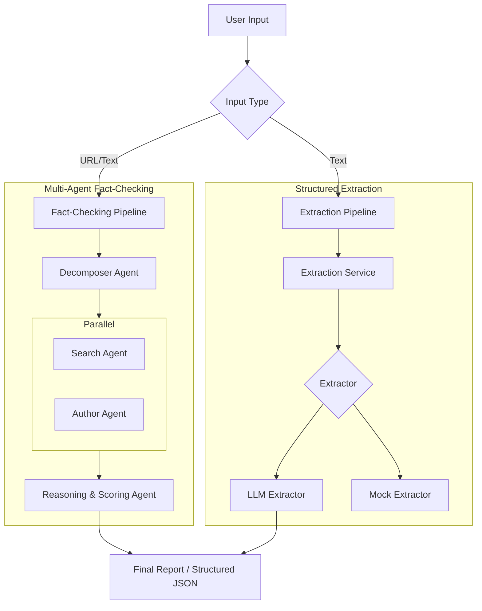
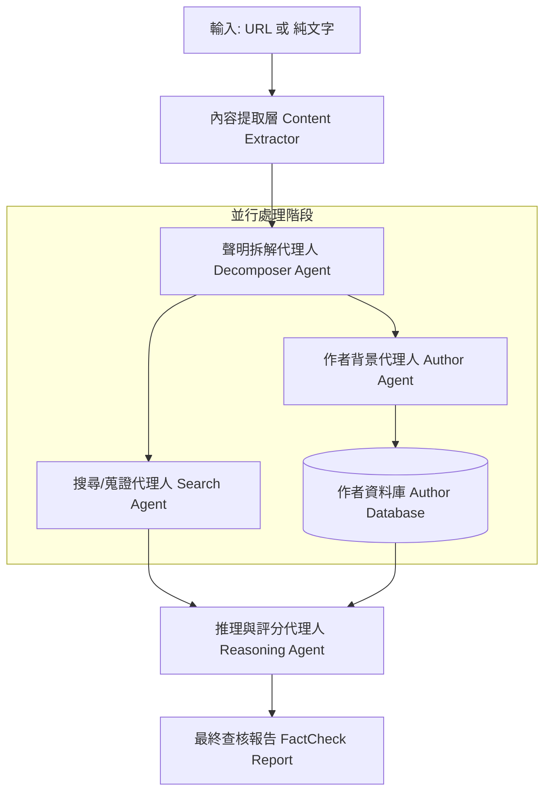

# AI Fast Track: Structured Extraction & News Fact-Checking

[English](#english) | [中文版](#chinese)

---

<a name="english"></a>
## 🌍 English Version

A powerful suite of AI-driven tools for processing unstructured data, featuring high-precision extraction and multi-agent news verification.

### 🛠️ Core Products

#### 1. Structured Data Extraction Tool
Accurately transforms messy, unstructured text (meeting notes, briefs, emails) into type-validated JSON format.
- **Automated Summaries**: Extract key entities and summaries instantly.
- **Action Tracking**: Identify Action Items and Deadlines automatically.
- **Risk Assessment**: Filter potential risks from reports.

#### 2. News Fact-Checking Service
A domain-aware multi-agent asynchronous engine to verify the authenticity of news articles.
- **Dual Input**: Support for both URLs and raw text.
- **Claim Decomposition**: Automatically splits complex articles into verifiable claims.
- **Parallel Evidence Gathering**: Synchronous search for evidence and author credibility assessment.
- **Logical Reasoning**: Score-based fact-checking (0-100) using multi-source cross-referencing.

### 🏗️ Architecture



### 🚀 Usage

#### CLI
```bash
# Data Extraction
python run.py extract "The project deadline is next Friday."

# News Fact-Checking
python run.py fact-check "https://example.com/news-story"
```

#### API
```bash
# Start Server
python run.py serve --port 8000

# Endpoints:
# POST /extract    { "text": "..." }
# POST /fact-check { "text": "..." }
```

---

<a name="chinese"></a>
## 🚀 中文版

這是一個基於大語言模型 (LLM) 的 AI 處理套件，包含**結構化資料提取**與**多代理人新聞查核**兩大核心功能。

### 📦 核心產品

#### 1. 結構化資料提取工具 (Structured Extraction)
將混亂的非結構化文字（會議記錄、Email）精準轉化為具備校驗格式的 JSON。
- **自動摘要**：快速提取關鍵實體與精簡摘要。
- **行動追蹤**：自動辨識行動清單 (Action Items) 與截止日期。
- **風險評估**：從報告中篩選潛在風險。

#### 2. 新聞查核服務 (News Fact-Checking)
具備領域感知的非同步查核引擎，自動化分析新聞真實性。
- **雙輸入支援**：支援網頁連結 (URL) 或純文字。
- **聲明拆解**：將文章拆解為多個獨立的可驗證聲明 (Claims)。
- **並行蒐證**：同步進行證據搜尋與作者歷史可信度評核。
- **邏輯推理**：綜合多方證據產出合理性評分 (0-100)。

### 🗺️ 系統架構 (System Architecture)



### 🛠️ 快速開始

#### 環境設定
1. **建立虛擬環境**：`python -m venv .venv`
2. **安裝依賴**：`pip install -r requirements.txt`
3. **設定變數**：`cp .env.example .env` (填入 OpenAI/Gemini API Key)

#### 執行範例
- **查核新聞**: `python run.py fact-check "新聞連結或內容"`
- **提取資料**: `python run.py extract "文字內容"`
- **啟動 API**: `python run.py serve`

### 🧰 開發工具 (Dev Tooling)
- **格式化**: `ruff format`
- **靜態檢查**: `ruff check`
- **類型校驗**: `mypy app`
- **自動化測試**: `pytest tests/` (目前共 41 個測試項目全數通過)
