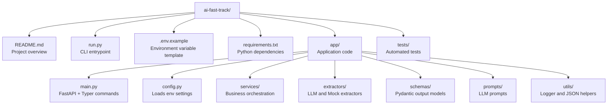
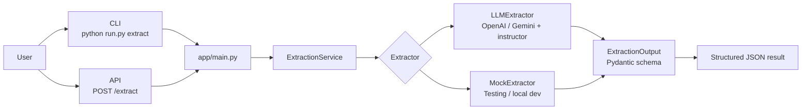
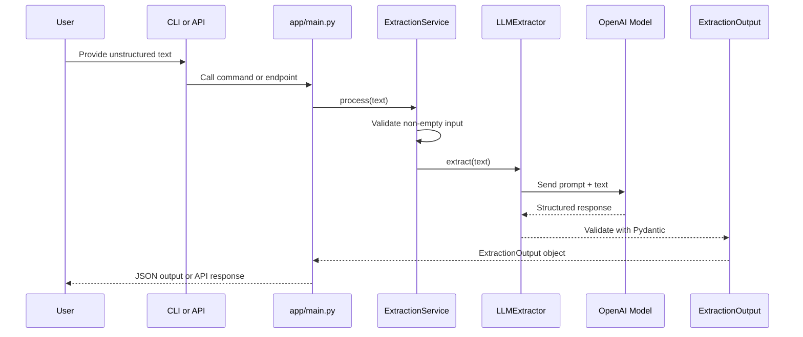
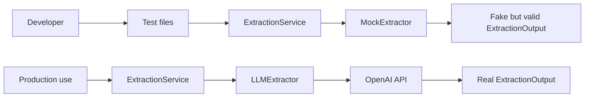
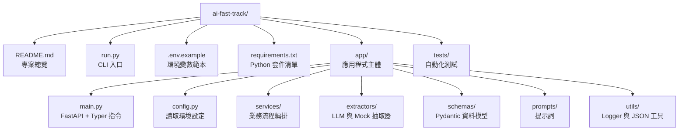
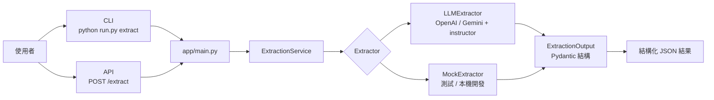
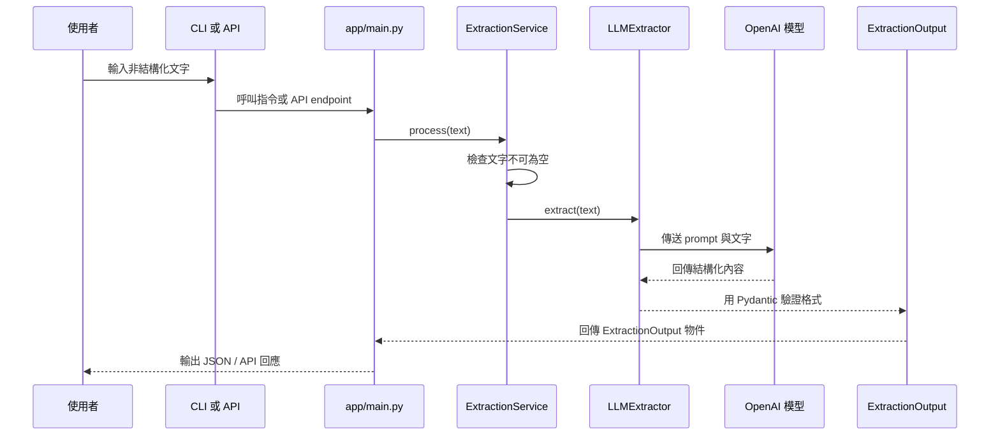
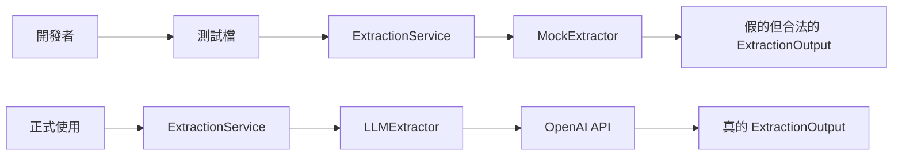

# AI Structured Extraction Tool

[English](#english) | [中文版](#chinese)

---

<a name="english"></a>
## English Version

This is a **Structured Data Extraction Tool** based on Large Language Models (LLM). It accurately transforms messy, unstructured text (such as meeting notes, project briefs, or emails) into type-validated JSON format.

### 🚀 What can it do?
- **Automated Meeting Summaries**: Quickly extract summaries and key entities from any text.
- **Action Item Tracking**: Automatically identify Action Items and Deadlines.
- **Risk Assessment**: Filter out potential risks from reports.
- **Workflow Integration**: Provides an API interface for easy integration into existing automation or web apps.

### ✨ Key Features
- **Dual Interface**: Supports both high-efficiency **CLI** commands and a powerful **FastAPI** server.
- **Structural Validation**: Uses Pydantic to ensure all outputs match predefined data contracts.
- **Flexible Extractor Design**:
    - `LLMExtractor`: Precise extraction using OpenAI or Gemini + `instructor`.
    - `MockExtractor`: For development and testing without an API Key.
- **Prompt Decoupling**: Independent `prompts/` module for easy optimization of LLM results.

### 🏗️ Modular Architecture
- **`app/services/`**: Business logic orchestration layer.
- **`app/extractors/`**: Core extraction engines (LLM & Mock strategies).
- **`app/schemas/`**: Data model definitions (Pydantic).
- **`app/prompts/`**: Centralized management for LLM prompts.
- **`app/utils/`**: General utilities like Logger and JSON parser.

### 🗺️ Architecture Flowcharts

#### 1. Project Map
This diagram shows where the important files live and what each area is responsible for.



#### 2. High-Level Architecture
This is the main idea of the whole project: both the CLI and API go through the same service layer.



#### 3. Runtime Request Flow
This shows what happens after a piece of text enters the system.



#### 4. Test and Development Flow
This explains why the project has both a real extractor and a mock extractor.



#### How to Read This Project
- Start from `run.py` if you want to know how the program starts.
- Read `app/main.py` to understand the CLI commands and API routes.
- Read `app/services/extraction_service.py` to see the core workflow.
- Read `app/extractors/` to learn how the project swaps between real and mock extraction.
- Read `app/schemas/extraction.py` to understand the final JSON structure.

### 🛠️ Quick Start

#### Setup
1. **Create Virtual Environment**:
   ```bash
   python -m venv .venv
   source .venv/bin/activate
   ```
2. **Install Dependencies**:
   ```bash
   pip install -r requirements.txt
   ```
3. **Environment Variables**:
   ```bash
   cp .env.example .env
   # Pick a provider and add the matching API key to .env
   ```

   OpenAI example:
   ```env
   LLM_PROVIDER=openai
   OPENAI_API_KEY=your_openai_api_key_here
   OPENAI_MODEL=gpt-4o
   ```

   Gemini example:
   ```env
   LLM_PROVIDER=gemini
   GEMINI_API_KEY=your_gemini_api_key_here
   GEMINI_MODEL=gemini-1.5-flash
   GEMINI_BASE_URL=https://generativelanguage.googleapis.com/v1beta/openai/
   ```

#### Usage
- **CLI**: `python run.py extract "Project A is due on June 1st."`
- **API**: `python run.py serve --port 8000`
- **Tests**: `export PYTHONPATH=$PYTHONPATH:. && pytest tests/`

---

<a name="chinese"></a>
## 中文版

這是一個基於大語言模型 (LLM) 的**結構化資料提取工具**。它可以將混亂、非結構化的文字（如會議記錄、專案簡報、Email 內容）精準地轉化為具備類型校驗的 JSON 格式。

### 🚀 這可以幹嘛用？
- **自動化會議摘要**：從一段文字中快速提取摘要、關鍵實體。
- **行動清單追蹤**：自動辨識文字中的 Action Items 與截止日期 (Deadlines)。
- **風險評估**：從報告中篩選出潛在風險 (Risks)。
- **整合工作流**：提供 API 接口，可輕易整合進既有的自動化流程或 Web 應用。

### ✨ 核心特色
- **雙介面支持**：同時提供高效的 **CLI** 指令與強大的 **FastAPI** 伺服器。
- **結構化校驗**：利用 Pydantic 確保所有輸出均符合預定義的資料合約。
- **靈活的 Extractor 設計**：
    - `LLMExtractor`：使用 OpenAI 或 Gemini + `instructor` 進行精準提取。
    - `MockExtractor`：用於開發與測試，無需 API Key 即可快速驗證流程。
- **提示詞解耦**：獨立的 `prompts/` 模組，方便優化 LLM 的提取效果。

### 🏗️ 模組化架構
- **`app/services/`**: 業務邏輯編排層，負責協調提取流程。
- **`app/extractors/`**: 核心提取引擎。
- **`app/schemas/`**: 資料模型定義。
- **`app/prompts/`**: 集中管理 LLM 提示詞。
- **`app/utils/`**: Logger、JSON 處理等通用工具。

### 🗺️ 架構流程圖

#### 1. 專案地圖
這張圖先幫你看懂：重要檔案在哪裡、每個資料夾主要負責什麼。



#### 2. 整體架構圖
這張圖是整個專案最重要的概念：不管你是走 CLI 還是 API，最後都會進到同一個 Service。



#### 3. 執行流程圖
這張圖是「輸入一段文字之後，系統內部到底怎麼跑」。



#### 4. 測試與開發流程圖
這張圖說明：為什麼專案同時有真的 `LLMExtractor`，也有假的 `MockExtractor`。



#### 怎麼讀這個專案
- 先從 `run.py` 看程式怎麼啟動。
- 再看 `app/main.py`，理解 CLI 指令和 API 路由。
- 接著看 `app/services/extraction_service.py`，它是主流程的中樞。
- 再看 `app/extractors/`，理解真實抽取與假資料抽取怎麼切換。
- 最後看 `app/schemas/extraction.py`，理解最後輸出的 JSON 長什麼樣。

### 🛠️ 快速開始

#### 環境設定
1. **建立虛擬環境**：`python -m venv .venv`
2. **安裝依賴**：`pip install -r requirements.txt`
3. **設定變數**：`cp .env.example .env`，再依你要用的供應商填入對應金鑰

   OpenAI 範例：
   ```env
   LLM_PROVIDER=openai
   OPENAI_API_KEY=your_openai_api_key_here
   OPENAI_MODEL=gpt-4o
   ```

   Gemini 範例：
   ```env
   LLM_PROVIDER=gemini
   GEMINI_API_KEY=your_gemini_api_key_here
   GEMINI_MODEL=gemini-1.5-flash
   GEMINI_BASE_URL=https://generativelanguage.googleapis.com/v1beta/openai/
   ```

#### 執行方式
- **CLI**: `python run.py extract "文字內容"`
- **API**: `python run.py serve`
- **測試**: `export PYTHONPATH=$PYTHONPATH:. && pytest tests/`
