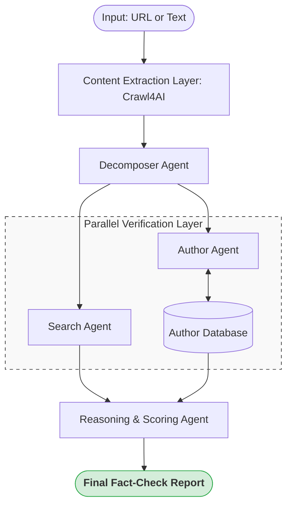

# AI Fast Track: Intelligent Structured Extraction & Multi-Agent Fact-Checking

<p align="center">
  
  
  
  
  
</p>

---

## 📖 Overview

**AI Fast Track** is a sophisticated AI-driven ecosystem designed to solve two critical data challenges: **Unstructured Data Intelligence** and **Automated Information Verification**. By leveraging Large Language Models (LLMs) and an asynchronous multi-agent architecture, it delivers enterprise-grade precision in data processing.

---

## 🚀 Key Modules

### 1. Structured Intelligence Engine (Extraction)
Transforms chaotic text into actionable data assets.
- **Precision Extraction**: Zero-shot and few-shot extraction for meeting minutes, project specs, and emails.
- **Browser-Based Scraping**: Powered by **Crawl4AI** for high-precision, asynchronous content extraction from complex websites.
- **Schema Enforcement**: Built on **Pydantic** to guarantee 100% type-safe JSON outputs.
- **Fail-Safe Design**: Includes a `MockExtractor` for CI/CD pipelines and local development without API costs.

### 2. Multi-Agent News Verifier (Fact-Checking)
An advanced orchestration layer for real-time information validation.
- **Claim Decomposition**: Automatically extracts high-priority verifiable statements from articles.
- **Cross-Source Evidence**: Parallelized search agents gather supporting/refuting data from diverse sources.
- **Author Reputation Intelligence**: Integrates with historical databases to evaluate the credibility of information sources.
- **Logical Synthesis**: A dedicated reasoning agent evaluates evidence consistency and assigns a weighted reliability score.

---

## 🏗️ System Architecture

### Multi-Agent Fact-Checking Workflow
The system orchestrates specialized agents using `asyncio` to minimize latency and maximize throughput.



---

## 🛠️ Getting Started

### Prerequisites
- Python 3.9+
- OpenAI or Gemini API Key

### Installation & Configuration
```bash
# Clone and setup environment
git clone https://github.com/your-username/ai-fast-track.git
cd ai-fast-track
python -m venv .venv
source .venv/bin/activate  # Windows: .venv\Scripts\activate
pip install -r requirements.txt

# Install browser engine for Crawl4AI
playwright install chromium

# Configure Environment
cp .env.example .env
```

### Environment Variables (`.env`)
| Variable | Description | Example |
| :--- | :--- | :--- |
| `LLM_PROVIDER` | AI Service Provider | `openai` or `gemini` |
| `OPENAI_API_KEY` | Your OpenAI Key | `sk-proj-...` |
| `GEMINI_API_KEY` | Your Gemini Key | `AIzaSy...` |

---

## 💻 Usage & API Reference

### Command Line Interface (CLI)
```bash
# Fact-check a news article
python run.py fact-check "https://www.bbc.com/news/technology-12345678"

# Extract structured data
python run.py extract "Meet with John at 3PM tomorrow regarding the Q1 budget."
```

### REST API Endpoints
| Method | Endpoint | Description | Payload |
| :--- | :--- | :--- | :--- |
| `POST` | `/fact-check` | Verify news content | `{ "text": "URL or Content" }` |
| `POST` | `/extract` | Extract structured info | `{ "text": "Content" }` |

#### Sample Fact-Check Response
```json
{
  "total_reliability_score": 85,
  "final_verdict": "Likely True",
  "claims_verified": [
    {
      "claim": "The company reported a 20% growth.",
      "verdict": "Supported",
      "reasoning": "Matching financial reports found on Bloomberg."
    }
  ],
  "author_background": {
    "author_name": "Jane Doe",
    "historical_score": 92,
    "reliability_assessment": "Highly Reliable"
  }
}
```

---

## 🧪 Development & Quality Assurance
We maintain high standards through rigorous testing and automated linting.

- **Test Suite**: Run `pytest tests/` (41 tests covering all agents and services).
- **Code Quality**: Built-in support for `Ruff` (linting/formatting) and `MyPy` (type checking).
- **CI/CD**: Automatic verification on every push via GitHub Actions.

---

## 🗺️ Roadmap
- [x] Multi-Agent Fact-Checking Engine
- [x] URL Content Extraction Layer
- [ ] Multi-Language Support (Traditional Chinese optimization)
- [ ] Integration with Tavily/Serper Search APIs
- [ ] Real-time Author Database Updates

---

## 📄 License
Distributed under the **MIT License**. See `LICENSE` for more information.

---

## 中文簡介 (Quick Chinese Summary)

**AI Fast Track** 是一套專業的 AI 數據處理工具，結合大語言模型與多代理人 (Multi-agent) 架構，解決「非結構化數據提取」與「新聞真實性查核」兩大痛點。其核心優勢在於：
- **高精度爬蟲**：採用 **Crawl4AI** 驅動的瀏覽器級別提取技術，完美應對複雜的新聞網站。
- **異步執行效率**：全文非同步工作流，最大化數據處理通量。
- **Pydantic 驅動**：嚴格的數據校驗，確保所有 AI 產出均符合企業級應用標準。
