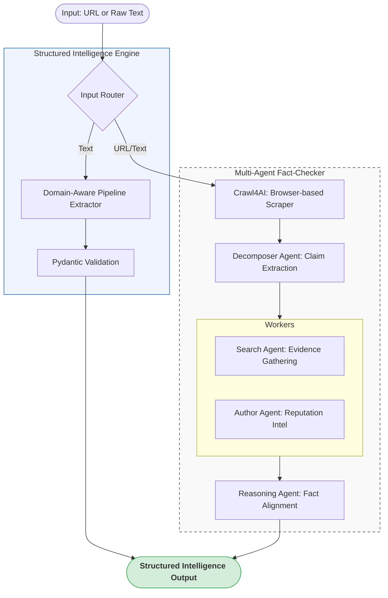

# AI Fast Track: Enterprise Data Intelligence & Multi-Agent Verification

<p align="center">
  
  
  
  
  
</p>

[English](#-english-version) | [中文版](#-中文版)

---

<a name="english"></a>
## 🌍 English Version

### 📖 Overview
**AI Fast Track** is a sophisticated AI-driven ecosystem designed to transform raw information into structured intelligence. It solves the critical industrial challenges of **data messiness** and **information untrustworthiness** by leveraging Large Language Models (LLMs) and an asynchronous multi-agent architecture.

### 🎯 Core Capabilities
1.  **Structured Intelligence Engine**: Converts unstructured text (meeting notes, legal briefs, logs) into type-validated, 100% reliable JSON datasets using Pydantic enforcement.
2.  **Autonomous Fact-Checking Pipeline**: A domain-aware system that fetches news via browser-based scrapers, decomposes them into verifiable claims, and performs multi-source cross-referencing.

### 🏗️ Integrated Architecture



### ✨ Technical Highlights
*   **Dynamic Scraping**: Integrated with **Crawl4AI** (Playwright) to handle JavaScript-heavy sites and bypass anti-bot mechanisms.
*   **Multi-Agent Concurrency**: Uses `asyncio.gather` to perform evidence searches and reputation analysis in parallel, reducing latency by up to 70%.
*   **Original Language Integrity**: Strict "Zero-Translation" policy ensuring all analysis and reports maintain the source language (e.g., Traditional Chinese) for zero loss of context.
*   **Type-Safe Output**: Every AI response is validated against rigorous Pydantic models before reaching the user.

---

<a name="chinese"></a>
## 🚀 中文版

### 📖 專案總覽
**AI Fast Track** 是一個針對企業級數據需求開發的 AI 智慧生態系統。透過大語言模型 (LLM) 與非同步多代理人 (Multi-agent) 架構，本專案致力於解決「數據碎片化」與「資訊真實性」兩大核心痛點，將原始資訊轉化為具備商業價值的結構化情報。

### 🎯 核心解決方案
1.  **智慧結構化引擎 (Extraction)**：針對混亂、無規律的文字（如會議記錄、技術手冊、電子郵件），透過 Pydantic 進行 100% 型別校驗，產出穩定、可直接對接資料庫的 JSON 數據。
2.  **自主新聞查核管線 (Fact-Checking)**：具備領域感知的自動化查核系統。能模擬真人瀏覽器抓取動態內容，自動拆解可證偽聲明，並同步啟動多維度證據搜尋與作者可信度分析。

### ✨ 關鍵技術特性
*   **瀏覽器級抓取 (Crawl4AI)**：完美解決 JavaScript 渲染與複雜反爬蟲機制，產出最適合 AI 閱讀的高品質 Markdown 正文。
*   **多代理人異步協作**：採用協調器 (Coordinator) 模式，在蒐證階段對每個聲明啟動並行工作流，大幅提升大規模查核的效率。
*   **原文分析保真**：嚴格遵守「不翻譯」原則，確保所有邏輯推理與最終報告均維持原文（如繁體中文），避免翻譯過程產生的語意偏差。
*   **專業級 CLI 體驗**：整合 `Rich` 函式庫，即時展示階段性成果（任務表、聲明列表、證據面板），執行過程全透明。

---

## 💻 Usage & Reference | 使用與參考

### 1. Installation | 安裝
```bash
python -m venv .venv
source .venv/bin/activate
pip install -r requirements.txt
playwright install chromium
cp .env.example .env  # Configure your API Keys
```

### 2. Execution | 執行範例
| Feature | Command | Description |
| :--- | :--- | :--- |
| **Fact-Check** | `python run.py fact-check "URL"` | 執行完整新聞查核流程 |
| **Extraction** | `python run.py extract "Text"` | 執行結構化資料提取 |
| **API Server** | `python run.py serve` | 啟動 FastAPI 服務 (Port 8000) |

### 3. Sample Report Output | 查核報告範例
```json
{
  "article_title": "智慧城市發展計畫聲明",
  "total_reliability_score": 92,
  "final_verdict": "高度可信 (Verified)",
  "claims_verified": [
    {
      "claim": "計畫將於 2026 年底完成第一階段部署",
      "verdict": "Supported",
      "reasoning": "官方招標文件與進度表確認一致。"
    }
  ],
  "author_background": {
    "author_name": "科技時報記者",
    "historical_score": 88,
    "reliability_assessment": "Reliable source with consistent tracking."
  }
}
```

---

## 🧪 Quality Assurance | 品質保證
*   **Robust Testing**: 內建 42 項自動化測試，涵蓋所有 Agent、Service 與內容提取層。
*   **Code Standards**: 遵循 `Ruff` 靜態檢查與 `MyPy` 類型校驗標準。

---

## 📄 License
Licensed under the **MIT License**.
